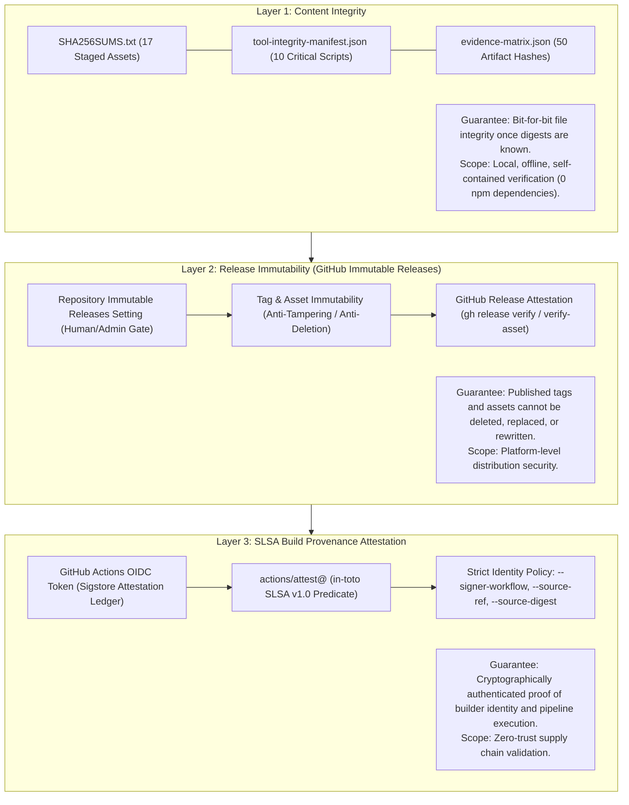
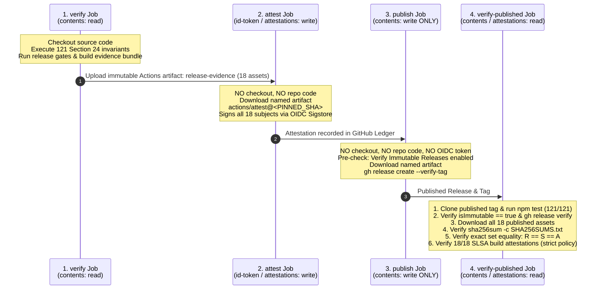

# RFC 0001: Track C - Supply-Chain Provenance & Cryptographic Assurance Architecture

- **RFC Number**: 0001
- **Title**: Track C - Supply-Chain Provenance & Cryptographic Assurance Architecture
- **Status**: Accepted
- **Authors**: Antigravity Pair Programming Engine & Maintainers
- **Created**: 2026-09-24
- **Target Release**: v1.8.0
- **Target Standards**: SLSA v1.0 (Build Level 2 target; Build Level 3 roadmap), in-toto Attestation Framework v1.0, NIST SP 800-218 (SSDF)

---

## 1. Executive Summary & Problem Statement

### 1.1 Context & Evolution
The `agy-security-audit` plugin provides automated security auditing under a strict Default-Deny assurance model. Releases v1.6.0 through v1.7.2 progressively closed the empirical evidence gap across all five dimensions of the Evidence Matrix:
- **DETERMINISTIC_HARNESS**: 20-pair deterministic disposition ground-truth.
- **LIVE_MODEL_EVALUATION**: Real model agent discovery evaluations.
- **LIVE_RUNTIME_ENFORCEMENT**: G6 runtime confinement matrix and dual-control hooks.
- **CROSS_PROVIDER_REPLICATION (Milestone G8-R)**: Contemporaneous cross-system replication (Gemini vs Claude Sonnet).
- **EXTERNAL_OSS_TRANSFER (Milestone G7-R)**: Live full-repository transfer across isolated historical open-source CVE snapshots.

In milestone v1.7.2, all five dimensions reached `SUPPORTED` status, supported by 50 physical artifact references and 10 tool integrity script hashes.

### 1.2 The Supply-Chain Boundary in v1.7.2
The integrity assurance in v1.7.2 is anchored by:
1. `SHA256SUMS.txt`: Cryptographic digest listing of 17 staged payload assets.
2. `skills/security-audit/tool-integrity-manifest.json`: SHA-256 hashes of 10 critical security scripts.
3. `evals/evidence-matrix.json`: Machine-readable matrix locking 50 physical artifact digests.

**The Architectural Gap**:
While SHA-256 digests provide robust **content integrity and local tamper detection**, they do not guarantee **release immutability, builder identity, or workflow provenance**:
- Content hashes prove that a file has not changed relative to a recorded digest, but they cannot prove *who produced the file*, *which GitHub Actions workflow executed the build*, or *whether the build occurred on a trusted build platform*.
- An adversary with repository write access or a compromised distribution mirror could simultaneously substitute both the release archive and `SHA256SUMS.txt`.
- GitHub Releases in v1.7.2 were published with `"immutable": false`, leaving historical releases susceptible to post-publication tampering or tag movement.

Track C formalizes and implements a complete supply-chain provenance architecture to close these gaps.

---

## 2. The 3-Layer Supply-Chain Assurance Model

Track C establishes three complementary, non-overlapping assurance layers:



### Layer 1: Content Integrity (Cryptographic Hashes)
- **Authority**: Content-addressed cryptographic digests.
- **Role**: Ensures that artifacts downloaded by consumers match the exact bytes verified during release staging.
- **Constraint**: Evaluated purely using Node.js built-in modules (`node:crypto`, `node:fs`). Zero external runtime dependencies.

### Layer 2: Release Immutability (GitHub Immutable Releases)
- **Authority**: GitHub Platform Attestation Authority.
- **Role**: Guarantees that once a release is published, the git tag cannot be moved, and release assets cannot be deleted or overwritten.
- **Mechanism**:
  - Enabled via repository settings (`Settings -> Releases -> Enable Immutable Releases`) or organizational policy. This is an administrative prerequisite.
  - Releases are published using standard `gh release create ... --verify-tag` (no client-side `--immutable` flag exists; immutability is automatically enforced by the platform upon publication).
  - Pre-publish check: The workflow validates `gh api repos/${GITHUB_REPOSITORY}/immutable-releases` (must return HTTP 200).
  - Post-publish verification: Evaluates `gh release view "$TAG" --json isImmutable` (`isImmutable == true`), followed by `gh release verify "$TAG"` and `gh release verify-asset "$TAG" "$asset"`.

### Layer 3: SLSA Build Provenance Attestation (Builder Identity)
- **Authority**: Sigstore Public Good Instance / GitHub Attestation Authority via OIDC.
- **Role**: Authenticates that the specific bytes of all release assets were produced by the authorized GitHub Actions workflow (`.github/workflows/release.yml`) running on a GitHub-hosted runner, triggered by an authentic tag reference (`refs/tags/v*`) at a specific commit SHA.
- **Target Standard**: SLSA v1.0 Build Level 2.

---

## 3. Threat Model & Security Boundaries

### 3.1 Threats Addressed (In-Scope)
1. **Post-Build Asset Substitution**: An attacker intercepting downloads or compromising a distribution mirror cannot substitute payload archives or tampering scripts without breaking cryptographic attestation verification.
2. **Workflow Impersonation**: Malicious or unauthorized workflows within forks or branches cannot produce valid attestations claiming to originate from `.github/workflows/release.yml` on `refs/tags/v*`.
3. **Historical Tag / Asset Rewriting**: Once an immutable release is published, compromised credentials cannot overwrite release archives or move tags to hide malicious backdoors.
4. **Publish-Stage Privilege Abuse**: By separating the attestation capability (`id-token: write`, `attestations: write`) from the publishing capability (`contents: write`), an attacker with publish permissions cannot forge build attestations.

### 3.2 Residual Risks & Non-Claims (Out-of-Scope)
> [!IMPORTANT]
> **Honest Accounting of SLSA Build Level 2**:
> - SLSA Build Level 2 proves **authenticity of origin and tamper-detection after build**; it does **not** prove that the build process itself was hermetic or that a compromised builder could not emit malicious bytes.
> - If the `verify` job execution environment is fully compromised, it could theoretically produce malicious artifacts that the subsequent `attest` job would faithfully attest.
> - Full resistance to build-time compromise requires **SLSA Build Level 3** (hardened build platforms, ephemeral isolated environments, and trusted reusable workflows), which is positioned on the post-v1.8.0 hardening roadmap.

---

## 4. 4-Stage Least-Privilege Release Pipeline Architecture

To maintain strict privilege separation and avoid privilege concentration, the release pipeline is partitioned into four decoupled jobs with minimal token scopes:



### Job Specifications

| Job | Checkout? | Executed Code | Token Permissions | Output / Role |
| :--- | :--- | :--- | :--- | :--- |
| **`verify`** | Yes (Tag) | Full repository test suite & build scripts | `contents: read` | Passes all 121 invariants; produces immutable `release-evidence` artifact. |
| **`attest`** | **NO** | First-party `actions/attest@<SHA>` only | `contents: read`<br/>`id-token: write`<br/>`attestations: write`<br/>`artifact-metadata: write` | Signs all 18 release assets with in-toto SLSA L2 provenance predicate. |
| **`publish`** | **NO** | First-party `download-artifact` & `gh` CLI | `contents: write` | Validates immutable release enablement; publishes immutable GitHub Release. |
| **`verify-published`** | Yes (Bare clone) | Tag gates + `gh` CLI verification | `contents: read`<br/>`attestations: read` | Independent verification closure: bare clone gates, immutability, and 18-subject provenance. |

---

## 5. Strict Verification Contract & Canonical Set Equality

### 5.1 The Canonical Set Equality Invariant
To prevent omissions, unauthorized additions, or basename confusion, downstream verification enforces strict set equality across three distinct inventories:

$$R = S = A$$

Where:
- $R$: Set of actual asset basenames downloaded from the published release ($\{r_1, r_2, \dots, r_n\}$).
- $S$: Set of unique asset basenames parsed from `SHA256SUMS.txt` plus `SHA256SUMS.txt` itself:
  $$S = \{ \text{basename}(line) \mid line \in \text{SHA256SUMS.txt} \} \cup \{ \text{"SHA256SUMS.txt"} \}$$
- $A$: Set of canonical subject basenames extracted from verified SLSA build provenance attestations:
  $$A = \{ \text{basename}(s.\text{name}) \mid s \in \text{attestation.statement.subject} \}$$

**Fail-Closed Tri-Match Invariant**:
1. $R = S$ (All published release assets match the checksum manifest exactly).
2. $S = A$ (All checksum manifest entries match the attested provenance subjects exactly).
3. Digest Equality:
   $$\forall \text{asset} \in R: \text{SHA256}(\text{local}) = \text{Digest}(S) = \text{Digest}(A)$$
4. Subject Normalization: All subjects are evaluated strictly by filename basename. Subdirectories, parent traversals (`..`), symlinks, and duplicate basenames are rejected fail-closed.

### 5.2 Strict Multi-Axis Verification Policy
`gh attestation verify` must never be run with repository scope alone. Verification mandates strict multi-axis identity binding:

```bash
gh attestation verify "$asset" \
  --repo "$GITHUB_REPOSITORY" \
  --signer-workflow "$GITHUB_REPOSITORY/.github/workflows/release.yml" \
  --source-ref "refs/tags/$GITHUB_REF_NAME" \
  --source-digest "$GITHUB_SHA" \
  --predicate-type "https://slsa.dev/provenance/v1" \
  --deny-self-hosted-runners
```

### 5.3 Identity Root-of-Trust Precedence
In conformance with GitHub Security Guidance, the attestation statement predicate (`statement.predicate`) is treated as untrusted metadata subject to verification, **never as the root of trust**.
The authority hierarchy is strictly ordered:
$$\text{Sigstore Cryptographic Certificate} > \text{Signer Workflow} > \text{Source Ref} > \text{Source Commit Digest} > \text{Predicate Claims}$$

---

## 6. Implementation Specifications

### 6.1 Action Pinning
All actions in the release workflow must be pinned to full 40-character commit SHAs. In particular, `actions/attest` must reference a reviewed, immutable release revision:
```yaml
uses: actions/attest@c074443f1a5fb4aee83904b7112375973fb06763 # v4.x.y reviewed SHA
```

### 6.2 Pre-Publish Immutable Releases Gate
In `publish`, before calling `gh release create`, the job must verify that repository release immutability is active:
```bash
status=$(gh api "repos/${GITHUB_REPOSITORY}/immutable-releases" -q .enabled 2>/dev/null || echo "false")
if [ "$status" != "true" ]; then
  echo "::error::Immutable Releases is NOT enabled for ${GITHUB_REPOSITORY}. Aborting release publication under Default-Deny." >&2
  exit 1
fi
```

### 6.3 Downstream Provenance Verifier (`scripts/verify-release-provenance.mjs`)
A zero-npm-dependency Node.js CLI script:
- **Modes**:
  - `STRICT` (default): Fails closed (exit code 1) if ambient `gh` CLI is missing, if `gh attestation verify` fails, or if canonical set equality $R = S = A$ is violated. Emits `✔ PROVENANCE_VERIFIED (SLSA Build L2)`.
  - `--integrity-only`: Verifies SHA-256 digests against `SHA256SUMS.txt` only. Emits `⚠ INTEGRITY_ONLY (UNATTESTED)` and never reports provenance verified.

---

## 7. Repository Governance & Invariant Protection

1. **Branch Ruleset on `main`**:
   - Mandate linear commit history.
   - Require pull request reviews prior to merging.
   - Require passing status checks (all 8 PR CI checks: Ubuntu, Windows, macOS, Semgrep, CodeQL).
2. **Tag Ruleset on `v*`**:
   - Prevent tag deletion and force-pushes.
   - Restrict tag creation to authorized maintainers.
3. **Signed Annotated Tags**:
   - Developer GPG/SSH tag signing (`git tag -s`) is classified as **SHOULD (Operational Best Practice)**.
   - CI enforces that the tag commit must be reachable from `main`.
4. **Invariant Counter Integrity**:
   - The Section 24 invariant count must strictly remain at **121**.
   - Provenance policy assertions will run as a dedicated, named test suite (`npm run test:provenance`) without inflating the canonical 121 invariant counter.

---

## 8. Migration & Rollout Plan

- **Phase 1 (This RFC & Technical Debt Cleanup)**:
  - Branch: `rfc/track-c-supply-chain-provenance`.
  - Deliverables: RFC 0001 authored in `docs/rfcs/0001-track-c-supply-chain-provenance.md`; P2 diagnostic wording in `scripts/test-evidence-matrix-gate.mjs` resolved (dynamic version and 50 deduplicated artifacts).
- **Phase 2 (Workflow & Script Implementation)**:
  - Repository Setting: Maintainer enables GitHub Immutable Releases.
  - Repository Setting: Maintainer enables Branch and Tag Rulesets.
  - Workflow: Update `.github/workflows/release.yml` with the 4-stage pipeline.
  - Tooling: Implement `scripts/verify-release-provenance.mjs`.
  - Verification: Execute end-to-end dry run on staging tag / mock repository.
