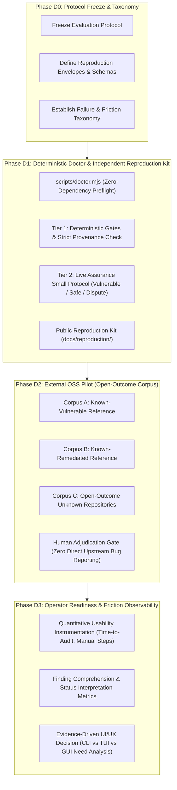

# RFC 0002: Track D - External Reproducibility, Real-World Transfer & Adoption Readiness

* **RFC Number**: 0002
* **Title**: Track D - External Reproducibility, Real-World Transfer & Adoption Readiness
* **Status**: Accepted
* **Authors**: Maintainers & Antigravity Security Engine
* **Created**: 2026-09-24
* **Baseline**: `agy-security-audit v1.8.1`
* **Baseline Commit**: `8af4bca5cdfef89c93649c03a70d43767875ffb7`
* **Target Release**: v1.9.0
* **Depends On**: RFC 0001 - Track C Supply-Chain Provenance & Cryptographic Assurance
* **Primary Objective**: Demonstrate that an unfamiliar operator can install, execute, understand, and independently verify `agy-security-audit` without maintainer intervention or privileged repository access.

---

## 1. Executive Summary & Problem Statement

### 1.1 Context & Predecessor Baseline

`agy-security-audit` v1.8.1 formally locks a comprehensive, production-grade internal assurance baseline:

* **Deterministic Invariant Discipline**: 121/121 Section 24 invariants locked; 62 release specifications; 40 authoritative security invariants.
* **Supply-Chain & Cryptographic Provenance (RFC 0001 / Track C)**: 19/19 provenance policy tests; SLSA Build Level 2 build provenance; GitHub OIDC / Public Good Sigstore signing; Rekor transparency log recording; Immutable GitHub Releases; exact canonical distribution equality `R = S = A = 18`.
* **Zero External Dependencies**: Pure Node.js built-ins across all production scripts and test gates.
* **Documentation Drift Protection**: Deterministic `scripts/check-docs-integrity.mjs` (`npm run check:docs`) gating version parity, invariant counts, onboarding instructions, and security policy.
* **Formal Track C Closure**: Formally verified, archived, and sealed under `v1.8.0` / `v1.8.1`.

These achievements prove that the project's internal claims are logically consistent, tamper-evident, cryptographically verifiable, and regression-resistant within maintainer-controlled environments.

### 1.2 The Assurance Boundary Shift: Producer Correctness vs Consumer Reproducibility

The governing architectural question is no longer:
> *Can the maintainer demonstrate that the audit engine's security claims and release artifacts are internally consistent and un-tampered?*

The governing Track D question is:
> **Can an unfamiliar operator, starting from a clean environment without maintainer presence, undocumented tacit knowledge, or privileged repository access, install, execute, understand, reproduce, and independently challenge the project's bounded assurance claims?**

Track D shifts the assurance boundary from **producer correctness** to **consumer reproducibility**. It establishes that the tool is usable, verifiable, transparent, and reproducible by third parties in the wild.

---

## 2. Core Axiom: Presumption of Non-Reproducibility

Track D extends the project's foundational *Default-Deny on Authority Claims* to external reproduction:

> **A security assurance system is not operationally mature merely because its author can reproduce it. All reproducibility claims default to `UNVERIFIED` until affirmative, clean-room, independently observed evidence is established.**

The project MUST NOT conflate:
- Maintainer reruns on different local machines with independent reproduction.
- Duplicated GitHub Actions CI jobs with consumer-side reproduction.
- Re-executing tests with observing an authentic LLM security decision.

---

## 3. Multi-Axis Independence & Authority Model

To avoid flattening diverse validation activities into an unhelpful boolean ("reproduced: true/false"), Track D measures reproducibility across six independent axes:

```text
                        ┌───────────────────────────────────────┐
                        │      Multi-Axis Independence Model    │
                        └───────────────────┬───────────────────┘
                                            │
       ┌───────────────────────┬────────────┴──────────┬────────────────────────┐
       ▼                       ▼                       ▼                        ▼
1. Operator Axis        2. Environment Axis     3. Protocol Axis        4. Runtime Axis
(Maintainer vs External) (Dirty vs Clean-Room)   (Dynamic vs Frozen)     (Mocked vs Live AGY)
                               │                                                │
                               ▼                                                ▼
                        5. Provider/Model Axis                         6. Intervention Axis
                        (Single vs Cross-LLM)                          (Autonomous vs Assisted)
```

### 3.1 Independence Axes Defined

1. **Operator Axis**: Distinguishes the author/maintainer from an external, unaffiliated operator.
2. **Environment Axis**: Distinguishes developer workspaces (containing caches, `.git`, `node_modules`, global configs) from hermetic, clean-room environments.
3. **Protocol Axis**: Distinguishes ad-hoc exploratory execution from execution against a cryptographically frozen evaluation protocol.
4. **Runtime Axis**: Distinguishes deterministic unit/CI harnesses from authentic live Antigravity CLI (`agy`) runtime invocations.
5. **Provider / Model Axis**: Distinguishes single-model executions from cross-model replications.
6. **Maintainer Intervention Axis**: Formally records whether the operator executed autonomously or required maintainer assistance.

### 3.2 Maintainer Intervention Policy & Evidence Degradation

> **Maintainer intervention MUST be observable, recorded, and trigger mandatory evidence downgrades.**

If an external evaluator encounters an obstacle (unclear error, failed installation, ambiguous finding status) and requests maintainer assistance:
- The intervention event MUST be preserved as valuable **usability friction data**.
- The execution run MUST be downgraded: it can serve as *Usability Feedback*, but MUST NOT claim *Independent Operator Reproduction*.
- Tacit guidance provided to the evaluator highlights a documentation or tooling bug that must be resolved in code or documentation before clean-room independence is claimed.

### 3.3 Reproduction Taxonomy

Track D defines four formal reproduction classifications:

| Classification | Operator | Environment | Protocol | Maintainer Assistance | Evidence Strength |
|---|---|---|---|---|---|
| **`SELF_REPLAY`** | Maintainer | Local / Developer | Ad-hoc or Scripted | Author-driven | Baseline sanity only |
| **`INDEPENDENT_ENVIRONMENT_REPLAY`** | Maintainer or CI | Clean-room / Disposable | Frozen Protocol | None | Proves environment independence, not operator independence |
| **`INDEPENDENT_OPERATOR_REPRODUCTION`** | Non-Maintainer | Independent machine | Frozen Protocol | **Zero intervention** | **Authoritative Track D acceptance proof** |
| **`EXTERNAL_SYSTEM_REPLICATION`** | Non-Maintainer | Independent stack / runtime | Frozen Protocol | Zero intervention | Frontier multi-system validation |

---

## 4. Track D Architecture: 4 Structured Phases



---

## 5. Phase D1: Deterministic Doctor & Reproduction Kit

### 5.1 Deterministic Environment Doctor (`scripts/doctor.mjs`)

An unfamiliar user's first interaction must not fail with obscure stack traces. The doctor provides immediate preflight diagnosis with **zero external dependencies**:

```bash
# Human-readable CLI diagnostic
npm run doctor

# Machine-readable JSON output for automated reproduction bundles
npm run doctor -- --json
```

#### Required Diagnostic Checks:
1. **Node.js**: Version `>= 20.0.0` (assert ESM and built-in crypto support).
2. **Git**: Version `>= 2.30.0` (assert safe-git isolation flags supported).
3. **Antigravity CLI (`agy`)**: Availability, executable path, and version `>= 1.2.0`.
4. **Platform & Architecture**: OS (win32, linux, darwin), architecture, shell environment.
5. **Plugin Layout**: Verified presence of `plugin.json`, `hooks.json`, `rules/AGENTS.md`.
6. **TCB Script Integrity**: Verification of `skills/security-audit/tool-integrity-manifest.json` against critical scripts.
7. **Permissions & Sandboxing**: Presence of `recommended-security-audit-permissions.json` and sandbox readiness.
8. **GitHub CLI (`gh`)**: Version `>= 2.50.0` (optional; marked `DEGRADED` for provenance verification if absent).

#### Honest Diagnostic Classification:
Checks MUST report one of four explicit states:
- **`READY`**: Prerequisite fully satisfied.
- **`DEGRADED`**: Non-essential capability unavailable (e.g. `gh` missing, strict SLSA verification disabled).
- **`UNSUPPORTED`**: Critical requirement violated (e.g. Node.js `< 20.0.0`).
- **`UNVERIFIABLE`**: Static presence detected, but live enforcement unobserved (e.g. sandbox config present without canary run). `UNVERIFIABLE` MUST NOT silently become `READY`.

### 5.2 Two-Tier Reproduction Kit Architecture

To ensure reproduction is accessible without requiring days of compute or multi-gigabyte checkouts, Track D splits reproduction into two distinct tiers:

```text
Reproduction Kit Architecture
├── Tier 1: Deterministic Reproduction (Offline, Fast, 0 Dependencies)
│   ├── Clone from clean repository or extract release zip
│   ├── Verify release integrity & SLSA provenance (scripts/verify-release-provenance.mjs)
│   ├── Run Section 24 invariant tests (121/121 PASS)
│   ├── Run provenance policy tests (19/19 PASS)
│   ├── Run documentation integrity gate (check:docs PASS)
│   └── Run Section 24 release invariants gate (check:release PASS)
│
└── Tier 2: Live Assurance Small Protocol (Real LLM Execution)
    ├── Controlled Micro-Corpus:
    │   ├── 1x Clear Vulnerable Control (Known True Positive)
    │   ├── 1x Clear Safe Control (Known False Positive Guard)
    │   └── 1x Disputed / Boundary Control (Non-Trivial Architectural Tradeoff)
    ├── Live AGY CLI invocation under Default-Deny
    ├── Retain raw-stream NDJSON & execution attestation
    └── Generate validated reproduction-record.json
```

---

## 6. Phase D2: External OSS Pilot & The Open-Outcome Corpus

### 6.1 Departure from Known-Only Fixtures

Previous milestones (G7-R, G8-R) focused on historical CVE snapshots (`minimist`, `json-pointer`, `ini`) to prove recall and specificity against known ground truth.

While necessary for assurance baseline validation, known-only evaluations introduce selection bias. Track D introduces an **Open-Outcome Corpus** where the true vulnerability status is unknown prior to review:

```text
Track D Pilot Corpus Matrix:
1. Known-Vulnerable Reference: Validates sensitivity on real codebase.
2. Known-Remediated Reference: Validates specificity and suppression of fixed patterns.
3. Open-Outcome Repository:    Uncovers unexpected findings, benign idioms, framework confusion,
                               operator adjudication burden, and true zero-finding utility.
```

### 6.2 Pilot Corpus Selection Policy
Open-outcome candidate repositories MUST satisfy:
- Small to medium size (`<= 15,000` source lines of code) to permit exhaustive manual auditing.
- Permissive open-source license.
- Multiple active contributors and standard dependency patterns.
- Clear trust boundary (e.g. CLI tool, library, microservice).

### 6.3 Responsible Adjudication & Zero Direct Upstream Harassment Gate
> **NO AUTOMATED UPSTREAM DISCLOSURE.**
> All open-outcome findings generated during the pilot MUST undergo rigorous manual adjudication by security maintainers. Under no circumstances may automated scanner outputs or LLM transcripts be directly filed as public GitHub issues against upstream open-source projects.

---

## 7. Phase D3: Operator Readiness & Friction Observability

### 7.1 Quantitative Usability Instrumentation

Track D rejects subjective Likert surveys ("rate 1-5 how much you like this tool"). Instead, it observes and logs concrete operational friction metrics:

```json
{
  "$schema": "https://antigravity.google/schemas/security-audit/operator-metrics.schema.json",
  "timeToInstallSeconds": 45,
  "timeToFirstSuccessfulAuditSeconds": 180,
  "timeToFirstUnderstoodFindingSeconds": 120,
  "manualFilesOpenedCount": 4,
  "rerunsRequiredCount": 0,
  "commandsRetriedCount": 0,
  "helpRequestsCount": 0,
  "misinterpretedStatusesCount": 0,
  "findingAdjudicationSeconds": 150,
  "evidenceFilesManuallyInspectedCount": 3,
  "operatorFrictionNotes": []
}
```

### 7.2 Interface Decision Gate: CLI vs TUI vs GUI

The purpose of Phase D3 is to provide empirical data before deciding on user interface investments:
- If `manualFilesOpenedCount` and `findingAdjudicationSeconds` are high due to raw JSON/SARIF navigation, a Terminal User Interface (TUI) or specialized Markdown viewer is indicated.
- If friction lies in configuration and invocation, CLI interactive prompts (`agy` slash commands) must be improved.
- No GUI shall be constructed without documented friction data establishing that the CLI/TUI is insufficient.

---

## 8. Machine-Readable Reproduction Record Schema

Track D specifies `schemas/reproduction-record.schema.json`. Every reproduction run emits a verifiable envelope:

```json
{
  "schemaVersion": "1.0.0",
  "projectVersion": "1.8.1",
  "sourceCommit": "8af4bca5cdfef89c93649c03a70d43767875ffb7",
  "releaseTag": "v1.8.1",
  "releaseAssetName": "agy-security-audit-v1.8.1.zip",
  "releaseAssetDigest": "2a0ece157b0264fc2cfd2efc8d87de78696ffe3a3d79fd01bfa8f83153ee04da",
  "releaseAssetDigestSource": "GITHUB_RELEASE_API",
  "operatorClass": "INDEPENDENT_OPERATOR",
  "reproductionClassification": "INDEPENDENT_OPERATOR_REPRODUCTION",
  "maintainerAssistance": false,
  "environment": {
    "os": "linux",
    "arch": "x64",
    "nodeVersion": "v20.18.0",
    "gitVersion": "2.43.0",
    "agyVersion": "1.2.2",
    "ghVersion": "2.54.0"
  },
  "tier1Results": {
    "status": "PASS",
    "section24Invariants": "121/121",
    "provenancePolicy": "19/19",
    "docsIntegrity": "PASS",
    "releaseInvariants": "62_SPECS_40_INVARIANTS_0_DEPS"
  },
  "tier2Results": {
    "status": "PASS",
    "vulnerableControl": "TRUE_POSITIVE_CONFIRMED",
    "safeControl": "FALSE_POSITIVE_SUPPRESSED",
    "disputeControl": "ORACLE_DISPUTE_RECONCILED",
    "streamDigest": "e3b0c44298fc1c149afbf4c8996fb92427ae41e4649b934ca495991b7852b855"
  },
  "startedAt": "2026-09-24T07:00:00Z",
  "completedAt": "2026-09-24T07:08:30Z",
  "overallVerdict": "PASS"
}
```

---

## 9. Non-Goals (Explicit Scope Locks)

To prevent scope creep and maintain strict defensive rigor, Track D explicitly declares the following **OUT OF SCOPE**:

1. **No SLSA Build Level 3**: Remains an architectural roadmap item; not required for consumer reproducibility.
2. **No Trusted Reusable Builders**: Build provenance remains anchored to GitHub Actions OIDC and Sigstore.
3. **No SBOM Architecture**: Software Bill of Materials generation or attestation is separate and out of scope.
4. **No Commercial / Hosted Infrastructure**: No centralized backend, no hosted model proxy, no telemetry phone-home.
5. **No GUI Implementation**: Full graphic user interfaces are excluded until D3 operator metrics prove necessity.
6. **No Section 24 Invariant Count Modification**: The canonical count remains **strictly locked at 121/121**. Track D assertions belong in dedicated test suites (`test:doctor`, `test:reproducibility`).
7. **No Evidence Matrix Dimension Expansion**: The existing 5/5 `SUPPORTED` matrix is preserved. Track D does not prematurely add an un-substantiated dimension.
8. **No Claims of Universal Security**: Reproduction proves process and claim reproducibility; it never proves a target repository is free of vulnerabilities.

---

## 10. Track D Acceptance Criteria

| ID | Title | Acceptance Requirement |
|---|---|---|
| **D-AC-01** | **Deterministic Environment Doctor** | `scripts/doctor.mjs` runs with 0 npm dependencies, inspects Node, Git, AGY, OS, permissions, and TCB manifests, correctly emitting `READY`, `DEGRADED`, `UNSUPPORTED`, or `UNVERIFIABLE`. |
| **D-AC-02** | **Doctor CLI & JSON Modes** | `npm run doctor` provides human-readable summary; `npm run doctor -- --json` outputs schema-compliant JSON without network egress. |
| **D-AC-03** | **Reproduction Kit Documentation** | `docs/reproduction/` provides self-contained instructions for clean-room reproduction of both Tier 1 (deterministic) and Tier 2 (live assurance) suites. |
| **D-AC-04** | **Safe Quickstart Verification** | A clean operator runs the safe quickstart fixture and obtains a bounded clean result with zero false alarms. |
| **D-AC-05** | **Vulnerable Quickstart Verification** | A clean operator runs the vulnerable quickstart fixture and obtains the documented authoritative finding with valid evidence binding. |
| **D-AC-06** | **Consumer Provenance Verification Path** | Consumer verification documentation (`docs/verify-release.md`) enables third parties to independently verify published immutable releases via Sigstore/Rekor/gh. |
| **D-AC-07** | **Platform Compatibility Transparency** | Platform support is explicitly broken down into evidence grades (`DECLARED`, `CI_TESTED`, `LIVE_RUNTIME_VALIDATED`, `UNSUPPORTED`, `UNKNOWN`). |
| **D-AC-08** | **Existing Assurance Preservation** | All baseline guarantees (121 Section 24 invariants, 19 provenance tests, 62 specs, 40 security invariants, 0 npm dependencies, `check:docs`) pass 100% without modification. |
| **D-AC-09** | **Maintainer Clean-Room Reproduction** | The entire reproduction package executes successfully in a clean, isolated environment without unpublished artifacts (`MAINTAINER_CLEAN_ROOM_REPRODUCED`). |
| **D-AC-10** | **Independent Operator Reproduction** | At least one unaffiliated non-maintainer independently executes the published reproduction kit with zero maintainer intervention, submitting a valid reproduction record (`INDEPENDENTLY_REPRODUCED`). |

---

## 11. Release & Closure Semantics

### v1.9.0 GA Gate (Unblocked Release Cadence)

`v1.9.0 GA` MAY be tagged and released when criteria **D-AC-01 through D-AC-09** are fully satisfied.

At that milestone, Track D status is formally:
```text
TRACK D STATUS: IMPLEMENTED / REPRODUCIBILITY_READY
EXTERNAL STATUS: AWAITING_INDEPENDENT_REPRODUCTION
```

> **Design Choice**: The project does NOT hold back `v1.9.0 GA` indefinitely waiting for an external third party to happen upon the repository. Releasing `v1.9.0` provides the public, immutable vehicle that enables external parties to conduct reproduction.

### Final Track D Closure Gate

Track D transitions to:
```text
TRACK D STATUS: COMPLETE / VERIFIED / ARCHIVED
FINAL GRADE:    INDEPENDENTLY_REPRODUCED
```
**ONLY** when **D-AC-10** is satisfied by an authentic, validated third-party execution bundle.

If an independent reproduction uncovers an unreconciled failure or documentation falsehood, Track D transitions to:
```text
TRACK D STATUS: REOPENED
```
until the root cause is resolved and independently reverified.

---

## 12. Decision & Implementation Plan

### RFC Decision: ACCEPTED

Acceptance record:
- **Baseline Freeze**: `v1.8.1` (`8af4bca5cdfef89c93649c03a70d43767875ffb7`) remains frozen predecessor.
- **Branching Discipline**:
  - RFC 0002 submitted via dedicated documentation-only branch `rfc/track-d-external-reproducibility`.
  - Zero production code touched in RFC acceptance PR.
  - Upon RFC merge, implementation proceeds on branch `feat/track-d-reproducibility` targeting `v1.9.0`.
